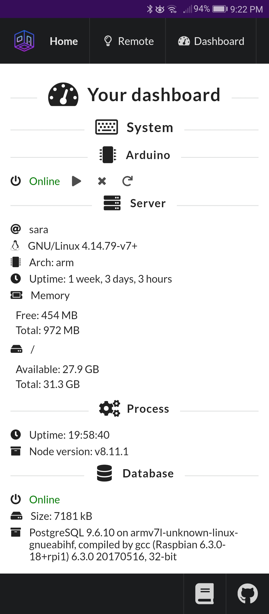
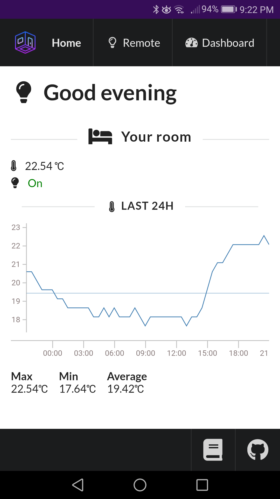
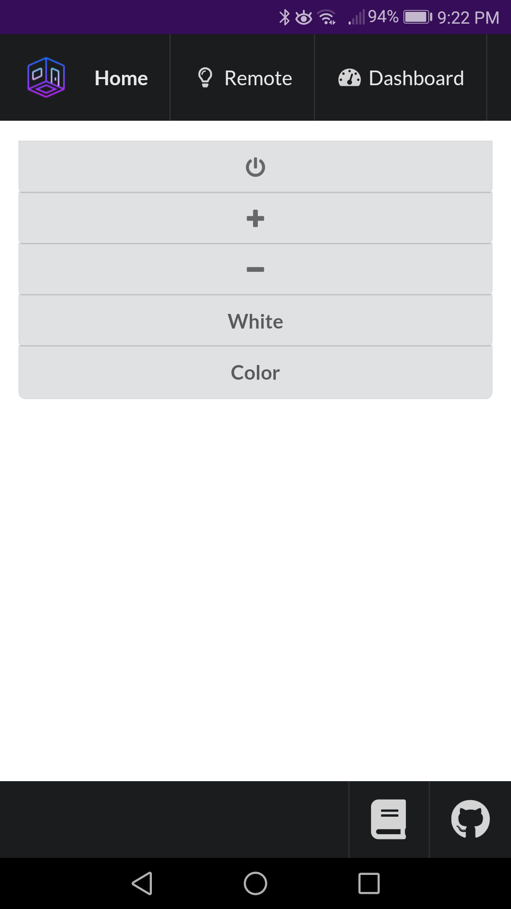

#  Sara &middot; 

Smart Assistant and Room Automation

## What is Sara?
Sara is a system that I use to control and monitor my room. At the moment it only has an handful of features such as

* Light control
* Temperature monitoring
* Light level monitoring

I plan on adding a lot more features as time goes on.

**[Live demo here!](https://streamable.com/bs8f8)**

  

## Warning
This is still in **beta**, this README (and all other READMEs) are bound to change and might be outdated

## Development
For instructions on how to setup Sara, see the [development](doc/development.md) document

## Deployment
For instructions on how to deploy Sara, see the [deployment](doc/deployment.md) document

## Updating
For instructions on how to update Sara, see the [updating](doc/updating.md) document

## License

This project is licensed under the MIT License - see the [LICENSE](LICENSE) file for details
